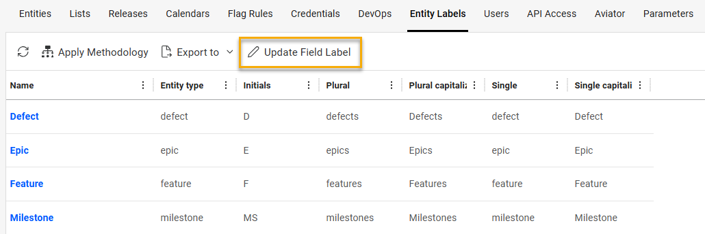
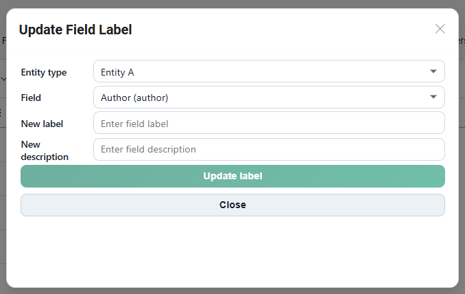

# Update Field Label

## 1) What This Extension Does

### Short Description
Update Field Label is an external action extension for OpenText SDP/SDM (ValueEdge/ALM Octane) that lets admins update any field label and description for any selected entity field through a dialog. This can be used to update fields for entities that are not available in the customization area.

### Where It Appears
- Space administration -> Entity labels tab toolbar

### Main Use Case
- Quickly rename a field (label + description) without manually editing metadata via API.

## 2) Screenshots





## 3) Disclaimers

1. This tool is an extension and not an OOTB functionality. We tested it a bit, and it looks good on our data and environment, but this is not an officially supported functionality of the product.
   This should be treated similarly to the other plugins that we have in our marketplace.

2. Once the extensions are loaded, they will be available to all users in the workspace. It is recommended that you try them in a demo workspace first.
   To show the extension in specific workspaces only, adjust the JSON structure and add something like:

```json
{
  "workspaces": [1001, 1002],
  "exclude_workspaces": [1003]
}
```

